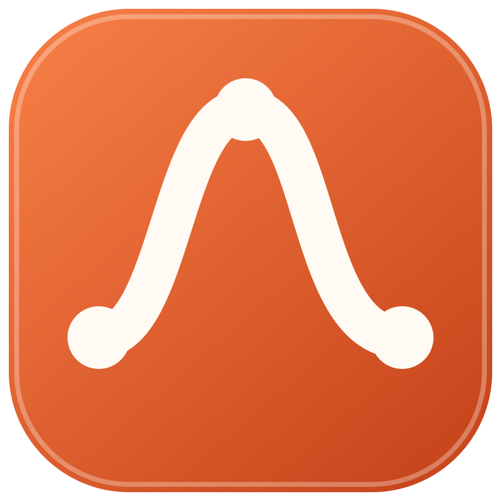
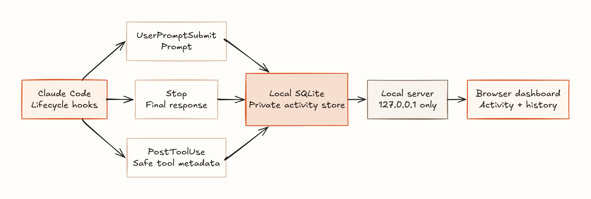

<div align="center">
  
  <h1>Prompt Contribution Graph</h1>
  <p><em>Track your daily prompt contributions across CLI coding agents.</em></p>

  <p>
    <a href="https://github.com/chintan-diwakar/prompt-contribution-graph/actions/workflows/desktop-builds.yml"></a>
    <a href="https://github.com/chintan-diwakar/prompt-contribution-graph/releases"></a>
    <a href="LICENSE"></a>
    
    
  </p>

  <p><strong>GitHub tracks code commits. Prompt Contribution Graph tracks your contributions to coding agents.</strong></p>
  <p>Prompts, final responses, and safe tool metadata. Stored locally. No account. No telemetry.</p>
</div>

> [!NOTE]
> The current release supports Claude Code. Prompt Contribution Graph is an unofficial community project that is not affiliated with Anthropic.


## Features

- Captures prompts and final responses through official Claude Code hooks.
- Records tool names, status, duration, and safe targets such as file paths.
- Stores activity and session details in a local SQLite database.
- Displays a 53-week contribution chart.
- Calculates the current streak, longest streak, and prompt totals.
- Displays one daily insight from your recent activity.
- Shares a dedicated aggregate activity image without exposing prompt or response content.
- Searches prompt and response text, then filters results by project.
- Deletes complete interactions from the dashboard.
- Preserves existing Claude Code hooks and settings.

## Requirements

- Node.js 22.5 or later
- Rust 1.77.2 or later for native builds
- Claude Code with hook support

## Desktop builds

The release workflow creates these desktop packages:

- An AppImage for general Linux distributions.
- A `.deb` package for Ubuntu and Debian-based distributions.
- A `.dmg` package for Intel and Apple silicon Macs.

The Tauri desktop application installs its Claude Code hooks on the first packaged launch. It uses the same local database as the command-line dashboard and existing Electron releases.

The current macOS packages do not have an Apple signature. macOS displays a security warning until a release uses signing and notarization.

### Share activity

The **Share** button renders a dedicated image containing only counts, streaks, the daily insight, and the contribution graph. It sends that PNG to the native share sheet when file sharing is available. The desktop fallback saves the PNG in the `Prompt Contribution Graph` folder in Pictures and opens an X post window. Prompt text, responses, project names, and tool details are not included.

### iOS build

The iOS target uses the same Tauri/Rust data commands and responsive interface. Its SQLite database lives in the iOS application sandbox. iOS cannot install or execute Claude Code hooks on a Mac, so the mobile database is separate unless an import or sync feature is added later.

Generate and build the Xcode project on a Mac:

```bash
rustup target add aarch64-apple-ios aarch64-apple-ios-sim x86_64-apple-ios
npm run ios:init -- --ci
npm run ios:build -- --target aarch64-sim --debug --no-sign --ci
```

Use `npm run ios:dev` to select a simulator or connected device interactively. `npm run ios:build -- --target aarch64 --no-sign --ci` also produces an unsigned release IPA. Installing it on a device or distributing it still requires an Apple Developer signing identity and provisioning profile.

## Install from this repository

1. Clone this repository.

   ```bash
   git clone https://github.com/chintan-diwakar/prompt-contribution-graph.git
   cd prompt-contribution-graph
   ```

2. Link the `prompttrail` command.

   ```bash
   npm link
   ```

3. Install the Claude Code hooks.

   ```bash
   prompttrail install
   ```

4. Start the local dashboard.

   ```bash
   prompttrail start
   ```

Prompt Contribution Graph opens `http://127.0.0.1:4317` in your browser. Submit a new Claude Code prompt to add the first entry.

## Commands

| Command | Result |
| --- | --- |
| `prompttrail install` | Adds the activity hooks to your user settings. |
| `prompttrail start` | Starts the dashboard and opens the browser. |
| `prompttrail start --no-open` | Starts the dashboard without browser launch. |
| `prompttrail start --port 8080` | Starts the dashboard on a different port. |
| `prompttrail status` | Displays the hook state, prompt count, and database path. |
| `prompttrail uninstall` | Removes only the Prompt Contribution Graph hooks. |

## How it works

Claude Code sends lifecycle events to the configured hooks. Prompt Contribution Graph writes each event to SQLite and returns immediately.



[Open the editable Excalidraw source](docs/prompttrail-system-design.excalidraw).

The dashboard server accepts connections only from your device. A failed capture does not stop Claude Code from processing the prompt.

Prompt Contribution Graph records these fields:

- Prompt text
- Submission time
- Claude session ID
- Project name and path
- Claude transcript path
- Final response text and status
- Total response duration
- Tool name, status, and duration
- File path or another safe target for supported tools

## Data location

Prompt Contribution Graph uses the standard data directory for each operating system.

| Operating system | Default database path |
| --- | --- |
| Linux | `~/.local/share/prompttrail/prompts.sqlite` |
| macOS | `~/Library/Application Support/PromptTrail/prompts.sqlite` |
| Windows | `%APPDATA%\PromptTrail\prompts.sqlite` |

Set `PROMPTTRAIL_HOME` to use a different directory.

```bash
PROMPTTRAIL_HOME=/private/prompt-data prompttrail start
```

The project keeps the `prompttrail` command, environment variable, hook marker, application ID, and data paths for compatibility.

## Privacy

Prompts and responses can contain source code, credentials, customer data, or other private text. Review the content before you share the database.

Prompt Contribution Graph does not store tool output. It does not store Bash command text or complete tool input.

Shared activity images and text contain only counts, streaks, the daily insight, and the contribution chart.

The installer updates `~/.claude/settings.json`. It writes the previous file to `settings.json.prompttrail.bak` before each change.

The uninstall command keeps the SQLite database. Delete the database file manually if you also want to delete all prompt history.

## Development

Run the automated tests.

```bash
npm test
```

Run JavaScript and Rust checks.

```bash
npm run check
```

Start the Tauri application.

```bash
npm run desktop
```

Build the Linux packages.

```bash
npm run build:linux
```

Build the macOS package on a Mac.

```bash
npm run build:mac
```

Build the unsigned iOS simulator application on a Mac.

```bash
npm run ios:init -- --ci
npm run ios:build -- --target aarch64-sim --debug --no-sign --ci
```

Use a temporary database during development.

```bash
PROMPTTRAIL_HOME="$PWD/.prompttrail-data" npm start -- --no-open
```

## Planned work

- The Electron-to-Tauri desktop migration and iOS build target are complete for v0.2.0. See the [migration record](docs/TAURI_MIGRATION.md) and [release plan](docs/RELEASE_V0.2.0.md).
- Add a Codex hook adapter and installer.
- Add an explicit database import/sync flow for the iOS companion app.
- Add optional prompt redaction rules.
- Add JSON and CSV export.
- Import existing Claude Code transcript files.
- Add labels and favorites.

## Contributing

Contributions are welcome. Read [CONTRIBUTING.md](CONTRIBUTING.md) before you create a pull request.

## License

Prompt Contribution Graph uses the [MIT License](LICENSE).
