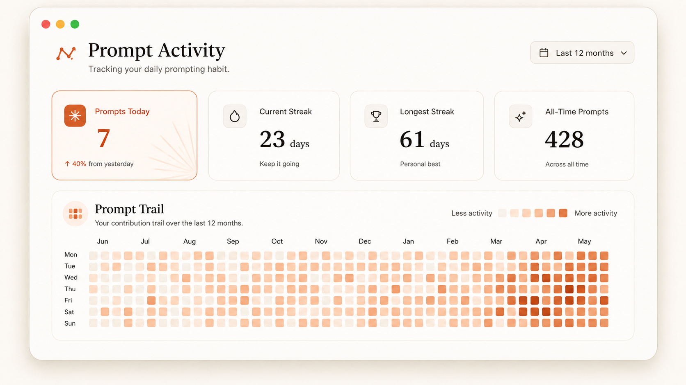

# PromptTrail

PromptTrail keeps a private history of your Claude Code activity. It displays prompts, final responses, and tool metadata in a local dashboard.

All activity data stays on your device. PromptTrail has no account, external service, analytics, or telemetry.

> [!NOTE]
> PromptTrail is an unofficial community project. It is not affiliated with Anthropic.



## Features

- Captures prompts and final responses through official Claude Code hooks.
- Records tool names, status, duration, and safe targets such as file paths.
- Stores activity and session details in a local SQLite database.
- Displays a 53-week contribution chart.
- Calculates the current streak, longest streak, and prompt totals.
- Displays one daily insight from your recent activity.
- Captures a private activity screenshot for the system share menu.
- Searches prompt and response text, then filters results by project.
- Deletes complete interactions from the dashboard.
- Preserves existing Claude Code hooks and settings.

## Requirements

- Node.js 22.5 or later
- Claude Code with hook support

## Desktop builds

The release workflow creates these desktop packages:

- An AppImage for general Linux distributions.
- A `.deb` package for Ubuntu and Debian-based distributions.
- A `.dmg` package for Intel and Apple silicon Macs.

The desktop application installs its Claude Code hooks on the first launch. It uses the same local database as the command-line dashboard.

The current macOS packages do not have an Apple signature. macOS displays a security warning until a release uses signing and notarization.

### Share an activity screenshot

The **Share** button captures the activity screen. The screenshot does not contain prompt text, response text, project names, or tool details.

On macOS, PromptTrail opens the system share menu. Select X, Messages, AirDrop, Mail, or another available service.

On Linux and Windows, PromptTrail copies the screenshot and opens an X post window. Paste the screenshot into the post.

PromptTrail also saves each screenshot in the `PromptTrail` folder in your Pictures directory.

## Install from this repository

1. Clone this repository.

   ```bash
   git clone https://github.com/chintan-diwakar/prompttrail.git
   cd prompttrail
   ```

2. Link the `prompttrail` command.

   ```bash
   npm link
   ```

3. Install the Claude Code hooks.

   ```bash
   prompttrail install
   ```

4. Start the local dashboard.

   ```bash
   prompttrail start
   ```

PromptTrail opens `http://127.0.0.1:4317` in your browser. Submit a new Claude Code prompt to add the first entry.

## Commands

| Command | Result |
| --- | --- |
| `prompttrail install` | Adds the activity hooks to your user settings. |
| `prompttrail start` | Starts the dashboard and opens the browser. |
| `prompttrail start --no-open` | Starts the dashboard without browser launch. |
| `prompttrail start --port 8080` | Starts the dashboard on a different port. |
| `prompttrail status` | Displays the hook state, prompt count, and database path. |
| `prompttrail uninstall` | Removes only the PromptTrail hooks. |

## How it works

Claude Code sends lifecycle events to the configured hooks. PromptTrail writes each event to SQLite and returns immediately.

```text
Claude Code hooks
    │
    ├── UserPromptSubmit ──► prompt
    ├── Stop ──────────────► final response
    └── PostToolUse ───────► safe tool metadata
                                  │
                                  ▼
                         local SQLite database
                                  ▲
                                  │
Browser dashboard ◄──── local server on 127.0.0.1
```

The dashboard server accepts connections only from your device. A failed capture does not stop Claude Code from processing the prompt.

PromptTrail records these fields:

- Prompt text
- Submission time
- Claude session ID
- Project name and path
- Claude transcript path
- Final response text and status
- Total response duration
- Tool name, status, and duration
- File path or another safe target for supported tools

## Data location

PromptTrail uses the standard data directory for each operating system.

| Operating system | Default database path |
| --- | --- |
| Linux | `~/.local/share/prompttrail/prompts.sqlite` |
| macOS | `~/Library/Application Support/PromptTrail/prompts.sqlite` |
| Windows | `%APPDATA%\PromptTrail\prompts.sqlite` |

Set `PROMPTTRAIL_HOME` to use a different directory.

```bash
PROMPTTRAIL_HOME=/private/prompt-data prompttrail start
```

## Privacy

Prompts and responses can contain source code, credentials, customer data, or other private text. Review the content before you share the database.

PromptTrail does not store tool output. It does not store Bash command text or complete tool input.

Shared activity screenshots contain only counts, streaks, the daily insight, and the contribution chart.

The installer updates `~/.claude/settings.json`. It writes the previous file to `settings.json.prompttrail.bak` before each change.

The uninstall command keeps the SQLite database. Delete the database file manually if you also want to delete all prompt history.

## Development

Run the automated tests.

```bash
npm test
```

Run the JavaScript syntax checks.

```bash
npm run check
```

Start the Electron application.

```bash
npm run desktop
```

Build the Linux packages.

```bash
npm run build:linux
```

Build the macOS package on a Mac.

```bash
npm run build:mac
```

Use a temporary database during development.

```bash
PROMPTTRAIL_HOME="$PWD/.prompttrail-data" npm start -- --no-open
```

## Planned work

- Add a Codex hook adapter and installer.
- Add optional prompt redaction rules.
- Add JSON and CSV export.
- Import existing Claude Code transcript files.
- Add labels and favorites.

## Contributing

Contributions are welcome. Read [CONTRIBUTING.md](CONTRIBUTING.md) before you create a pull request.

## License

PromptTrail uses the [MIT License](LICENSE).
